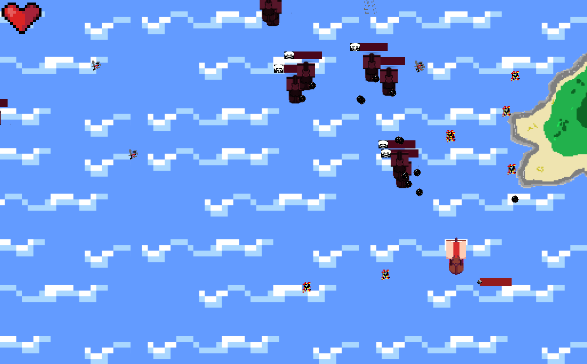
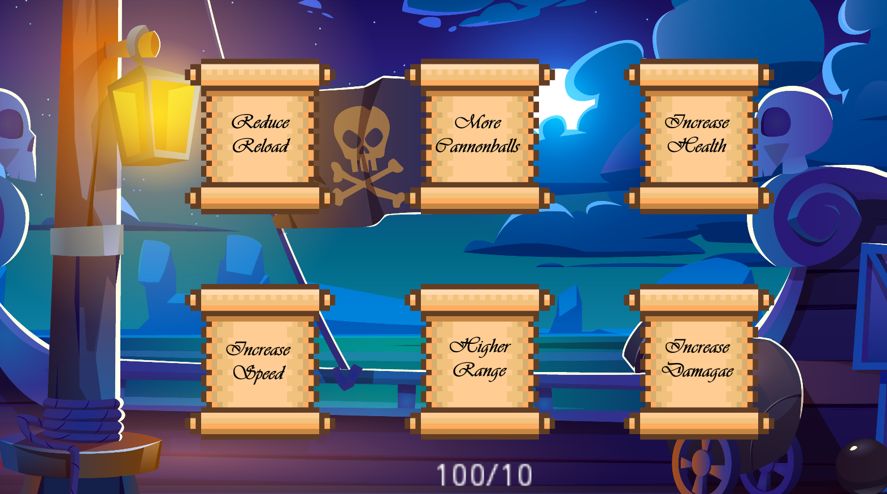

# Magni
Dieses Spiel entstand im Laufe der GameJam 3m5 2022. Die Bearbeitung hat sich über 16h verteilt auf 2 Tage gestreckt.

## Team
Das beteiligte Team bestand aus folgenden vier Mitgliedern:
- Tim Hanel
- Tuan Anh Nguyen
- Arismunandar
- Niklas Leukroth

## Thema
Aus einer zufällig generierten Wörterliste durften Begriffe frei gewählt werden, um das Thema zu difinieren.
Die verfügbaren Wörter sind dabei hier einzusehen:
- kaudodorsal
- orthodoxie
- vierkanthof
- Mittzwanziger
- Druckschriftensammlung
- Pluspolung
- Ramschladen
- kapitän
- abgetrotzt
- Weißschwanzgleitaar
- Lotwurz
- Lahmlegen
- ribonukleoprotein
- Hydroelektrizität
- missionschef
- repressionspolitik
- herausputzen
- direktion
- ausgegrenzt
- klauenhand

## Steuerung
| Taste  |  Aktion |
|---|---|
| W  |  Bewegung nach vorn |
| A  |  Bewegung nach links |
| S  | Bewegung zurück  |
|  D | Bewegung nach rechts  |
|  E | Interaktion mit dem Shop  |
| ESC  | Verlassen des Shops  |
| LMB  |  Feuern der Kanone |

